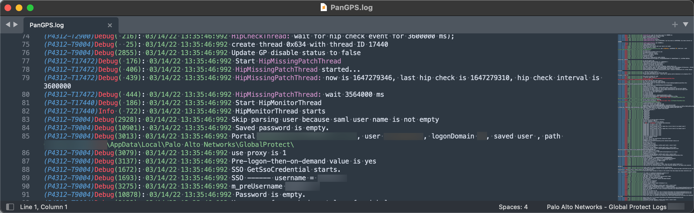
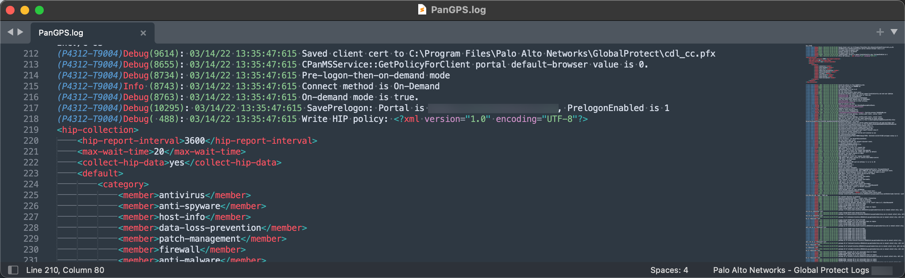

# Palo Alto Networks - Log file highlighting
## Release 0.06

Going through log files can be a pain.

The idea behind this repository is to highlight errors within the log files such that time spent troubleshooting can be kept to a minimum.

This is my first attempt at trying to use Sublime Text and it's syntax highlighting feature.

## Improved features
### Better Highlighting for:
* HIP Checks
* Gateway latency checking 
| Latency (ms) | Measurement | Color | 
| 0-170ms | great latency | green |
| 170-399ms | ok latency | | yellow |
| >400ms | bad latency| red |
* PKI entry checking
* network change highlighting
* Authentication cookie highlighting
* IPv4 and IPv6 address highlighting

## Example Screenshots




## Installing
### MacOS
1. Create a new directory in `~/Library/Application\ Support/Sublime\ Text\ 3/Packages/`.

```bash
$ mkdir -p ~/Library/Application\ Support/Sublime\ Text\ 3/Packages/Palo\ Alto\ Networks
```

2. Extract the `*.sublime-syntax` files into this new directory.

### Windows
1. Create a new directory in `%APPDATA%\Sublime Text 3\Packages`.
2. For this example, the new directory name is `Palo Alto Networks`.
3. Extract the `*.sublime-syntax` files into this new directory.

## Syntax Highlighting Capabilities

### ADEM Log files
#### Endpoint logs

* File name:  `palo_alto_networks_dem_agent.log` or `palo_alto_networks_dem_agent.1.log` 

To activate:
1. Click view
2. Syntax
3. Palo Alto Networks
4. `PAN ADEM Endpoint`

#### ION logs

* File name: `adem` or `adem.*`

To activate:
1. Click view
2. Syntax
3. Palo Alto Networks
4. `PAN ADEM ION Logs`

### GlobalProtect Log Files

* File name: `PanGPS.log` or `PanGPA.log`

To activate:
1. Click view
2. Syntax
3. Palo Alto Networks
4. `PAN GlobalProtect Logs`


## Reference files
* [Sublime Text](https://www.sublimetext.com)
* [Sublime Text Syntax](http://www.sublimetext.com/docs/syntax.html)

